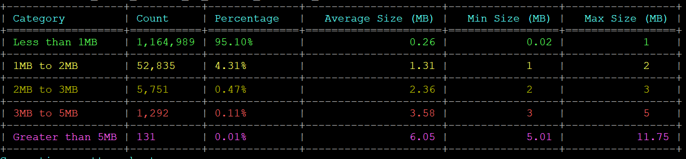
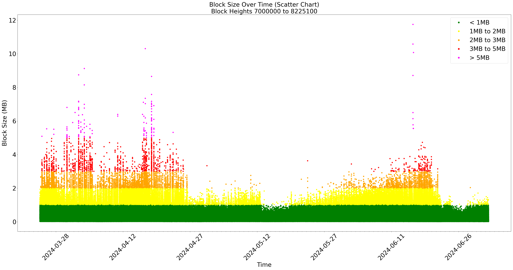
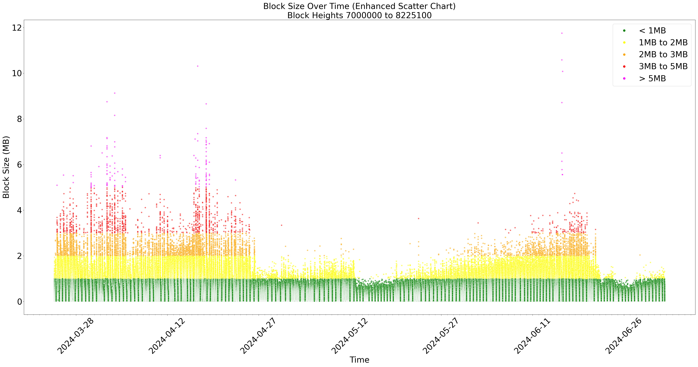
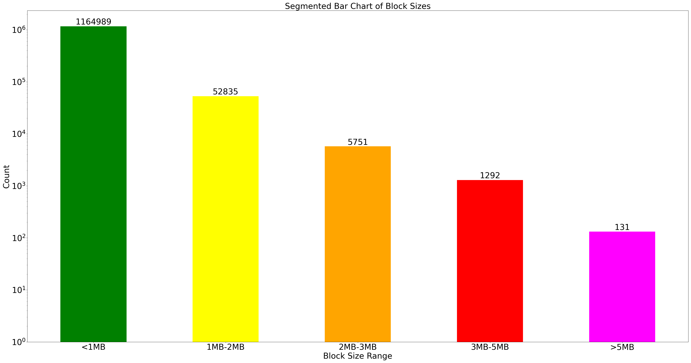

# BlockBusterAnalyzer

BlockBusterAnalyzer is a tool to monitor and analyze the sizes of blocks in a blockchain. It is a Python script that queries block sizes over a specified range and categorizes them into different size groups for statistical information.

## Features

- Query block sizes within a specified range
- Categorize blocks into size groups (<1MB, 1MB<2MB, 2MB<3MB, 3MB<5MB, greater than 5MB)
- Supports both Unix sockets and TCP endpoints
- Generates a JSON report with the results
- Provides progress updates during execution, including estimated time left and total duration
- Uses asyncio for asynchronous operations to improve performance for large block ranges
- Pretty console output with colors and table formatting
- Plots various graphs of block size over time
- Graceful shutdown on interrupt signals

## Dependencies

### Python

- `requests`
- `requests-unixsocket`
- `tqdm`
- `tabulate`
- `matplotlib`
- `pandas`
- `seaborn`
- `numpy`
- `aiohttp`
- `aiofiles`
- `concurrent.futures` (standard library, no extra installation required)

## Installation

### Python

#### Using `pip`

1. **Install Python dependencies**

    ```sh
    pip install requests requests-unixsocket tqdm tabulate matplotlib pandas seaborn numpy aiohttp aiofiles
    ```

2. **Create a virtual environment (optional but recommended)**

    ```sh
    python3 -m venv venv
    source venv/bin/activate  # On Linux and macOS
    ```

#### Using `apt-get` (Ubuntu/Debian)

1. **Install Python dependencies**

    ```sh
    sudo apt-get update
    sudo apt-get install python3-requests python3-requests-unixsocket python3-tqdm python3-tabulate python3-matplotlib python3-pandas python3-seaborn python3-numpy python3-aiohttp python3-aiofiles
    ```

## Usage

### Python Script

1. **Run the script**

    ```sh
    python3 blockbusteranalyzer.py <lower_height> <upper_height> <connection_type> <endpoint_url> [json_file_path]
    ```

    Example:

    ```sh
    python3 blockbusteranalyzer.py 7500000 7909000 "tcp" "https://rpc.jackalprotocol.com:443"
    python3 blockbusteranalyzer.py 7500000 7909000 "socket" "/dev/shm/jackal/trpc.socket"
    python3 blockbusteranalyzer.py 7500000 7909000 "tcp" "https://rpc.jackalprotocol.com:443" "block_sizes_7500000_to_7909000_20240614_100000.json"
    ```

## Output

The script will output the block sizes in JSON format and generate various graphs based on the block size data.

### Console Output Example



### Generated Graphs





## Contributing

Feel free to fork the project, submit pull requests, and file issues. We welcome contributions and improvements to BlockBusterAnalyzer!

## License

This project is licensed under the MIT License.
